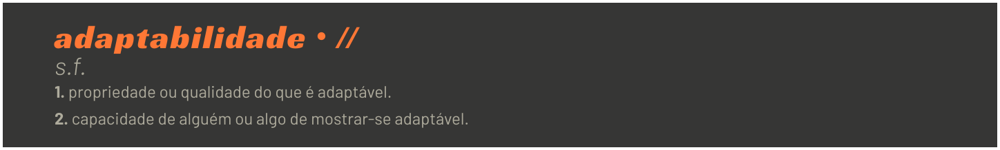

<p align="left">
    
</p>
# landing-page-adaptabilidade
Projeto desenvolvido como desafio proposto durante a Expansion Week do curso GoStack da Rocketseat :rocket:.


## Sobre o projeto
Esta landing page consiste em uma página estática cujo conteúdo apresenta o conceito da *soft skill* Adaptabilidade. Futuramente pode ser adicionada a funcionalidade para o formulário de inscrição.

Para preencher os textos em tela, foi utilizado a biblioteca **mdxc** que importa arquivos *markdown* como componentes *React*.

## Construído com
* [ReactJs](https://pt-br.reactjs.org/)


## Como Iniciar

### Instalação

1. Clone o repositório
```sh
git clone https://github.com/tpabarbosa/landing-page-adaptabilidade.git
```
2. Instale os pacotes de dependências
```sh
yarn 
```


## License

MIT :copyright:


## Contact

Tatiana Barbosa - tpabarbosa@yahoo.combr

